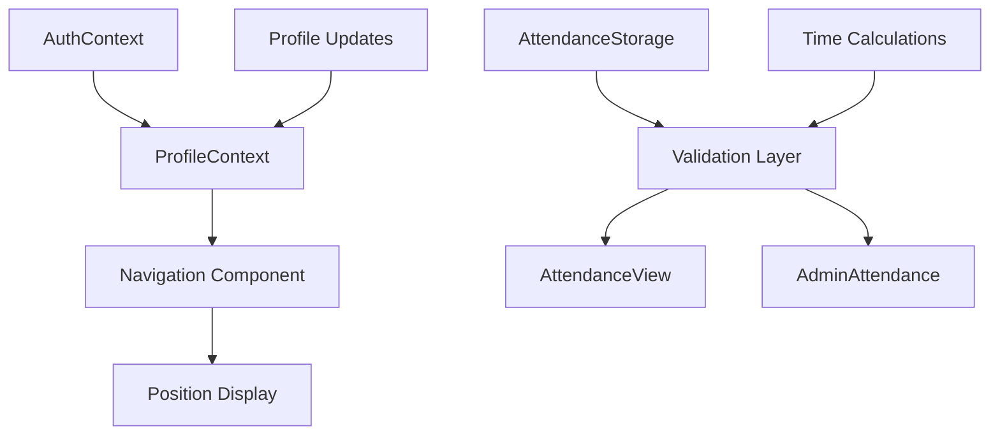

# Design Document

## Overview

This design addresses two critical improvements to the employee management system:
1. **Dynamic Position Display**: Enhance the sidebar navigation to show actual job positions from user profiles instead of static role-based text
2. **Attendance Data Validation**: Implement comprehensive validation to prevent negative values in all attendance calculations and displays

The solution focuses on improving data flow between the profile system and navigation components, while adding robust validation to the attendance calculation system.

## Architecture

### Component Interaction Flow



### Data Flow Architecture

1. **Profile Data Flow**: AuthContext → ProfileContext → Navigation → Display
2. **Attendance Data Flow**: Raw Time Data → Validation → Storage → Display Components
3. **Fallback Mechanism**: Profile Missing → Role-based Fallback → Consistent Display

## Components and Interfaces

### Enhanced Navigation Component

**Current Issues:**
- Uses hardcoded position mapping based on user role
- Limited integration with profile context
- No real-time updates when profile changes

**Design Changes:**
```typescript
interface NavigationProps {
  currentView: string;
  onNavigate: (view: string) => void;
  userRole: 'employee' | 'admin';
}

// Enhanced position resolution logic
const getPosition = (): string => {
  // Priority 1: Profile position data
  if (profileData?.employmentInfo?.position) {
    return profileData.employmentInfo.position;
  }
  
  // Priority 2: Role-based fallback with enhanced mapping
  if (currentUser) {
    return currentUser.role === 'HR' ? 'HR Manager' : 'Employee';
  }
  
  // Priority 3: Default fallback
  return 'Employee';
};
```

### Attendance Validation Layer

**Current Issues:**
- `calculateHoursWorked` can return negative values
- No validation of input parameters
- Missing error handling for invalid time formats

**Design Changes:**
```typescript
interface AttendanceValidation {
  validateTimeFormat(time: string): boolean;
  validateTimeRange(checkIn: string, checkOut: string): boolean;
  sanitizeHours(hours: number): number;
  logValidationWarning(message: string, data: any): void;
}

// Enhanced calculation with validation
function calculateHoursWorked(checkInTime: string, checkOutTime: string): number {
  // Input validation
  if (!validateTimeFormat(checkInTime) || !validateTimeFormat(checkOutTime)) {
    logValidationWarning('Invalid time format', { checkInTime, checkOutTime });
    return 0;
  }
  
  // Calculate hours with validation
  const hours = performTimeCalculation(checkInTime, checkOutTime);
  
  // Ensure non-negative result
  return sanitizeHours(hours);
}
```

## Data Models

### Enhanced Profile Integration

```typescript
interface ProfileContextType {
  profile: EmployeeProfile | null;
  profileName: string;
  profileInitials: string;
  profilePosition: string; // New: Direct position access
  updateProfile: (profile: EmployeeProfile) => void;
  isProfileLoaded: boolean; // New: Loading state
}
```

### Attendance Validation Models

```typescript
interface ValidatedAttendanceRecord extends AttendanceRecord {
  validationStatus: 'valid' | 'corrected' | 'error';
  originalHours?: number; // Store original value if corrected
  validationNotes?: string;
}

interface AttendanceCalculationResult {
  hours: number;
  isValid: boolean;
  correctionApplied: boolean;
  errorMessage?: string;
}
```

## Correctness Properties

*A property is a characteristic or behavior that should hold true across all valid executions of a system-essentially, a formal statement about what the system should do. Properties serve as the bridge between human-readable specifications and machine-verifiable correctness guarantees.*

### Property 1: Profile-Based Position Display
*For any* user with valid profile data containing position information, the sidebar should display that position and the profile context should provide this data to navigation components
**Validates: Requirements 1.1, 1.4, 3.4**

### Property 2: Comprehensive Non-negative Time Calculations
*For any* time calculation operation (including invalid inputs, negative results, or malformed data), the system should return zero or positive values and never negative values
**Validates: Requirements 2.1, 2.5, 4.1, 4.2**

### Property 3: Profile Update Propagation
*For any* profile position update, the sidebar display should reflect the change immediately and the navigation component should receive the updated profile data
**Validates: Requirements 1.3, 3.1**

### Property 4: Universal Display Layer Validation
*For any* attendance display (employee view, admin view, or summaries), all hour values shown should be non-negative and storage should validate numeric values before persistence
**Validates: Requirements 2.2, 2.3, 2.6, 4.5**

### Property 5: Graceful Fallback and Error Handling
*For any* user without complete profile data or when profile loading fails, the system should display appropriate fallback information without errors and maintain consistent formatting
**Validates: Requirements 1.2, 1.5, 3.3**

### Property 6: Profile System Integration
*For any* user login, the system should attempt to load profile information and maintain data consistency between profile page and sidebar display
**Validates: Requirements 3.2, 3.5**

## Error Handling

### Profile Loading Errors
- **Missing Profile**: Gracefully fallback to role-based position display
- **Incomplete Profile**: Use available data with appropriate defaults
- **Profile Load Failure**: Log error and continue with fallback mechanism

### Attendance Calculation Errors
- **Invalid Time Format**: Return zero hours and log warning
- **Negative Calculation**: Clamp to zero and log correction
- **Missing Time Data**: Handle gracefully with zero values
- **Cross-day Time Spans**: Implement proper 24-hour handling

### Real-time Update Errors
- **Profile Context Failure**: Maintain last known good state
- **Event Listener Errors**: Implement retry mechanism
- **State Synchronization Issues**: Provide manual refresh option

## Testing Strategy

### Unit Testing Approach
- **Position Display Logic**: Test all fallback scenarios and profile integration
- **Time Calculation Functions**: Test edge cases, invalid inputs, and boundary conditions
- **Validation Functions**: Test input sanitization and error handling
- **Profile Context Integration**: Test loading states and update propagation

### Property-Based Testing Configuration
- **Framework**: Use fast-check for TypeScript property-based testing
- **Test Iterations**: Minimum 100 iterations per property test
- **Input Generation**: Smart generators for time ranges, profile data, and user scenarios
- **Coverage**: Focus on edge cases and boundary conditions that unit tests might miss

**Property Test Examples:**
```typescript
// Property 1: Position Display Consistency
fc.test('position display uses profile data when available', 
  fc.record({
    profile: fc.record({ employmentInfo: fc.record({ position: fc.string() }) }),
    userRole: fc.constantFrom('employee', 'admin')
  }),
  ({ profile, userRole }) => {
    const position = getPositionWithProfile(profile, userRole);
    expect(position).toBe(profile.employmentInfo.position);
  }
);

// Property 2: Non-negative Hours Calculation
fc.test('hours calculation never returns negative values',
  fc.tuple(fc.timeString(), fc.timeString()),
  ([checkIn, checkOut]) => {
    const hours = calculateHoursWorked(checkIn, checkOut);
    expect(hours).toBeGreaterThanOrEqual(0);
  }
);
```

### Integration Testing
- **Profile-to-Sidebar Flow**: Test complete data flow from profile updates to sidebar display
- **Attendance Calculation Pipeline**: Test end-to-end attendance data processing
- **Real-time Synchronization**: Test event-driven updates across components
- **Error Recovery**: Test system behavior under various failure conditions

### Testing Balance
- **Unit Tests**: Focus on specific functions and component behavior
- **Property Tests**: Verify universal correctness properties across all inputs
- **Integration Tests**: Validate component interactions and data flow
- **Manual Testing**: Verify user experience and visual consistency